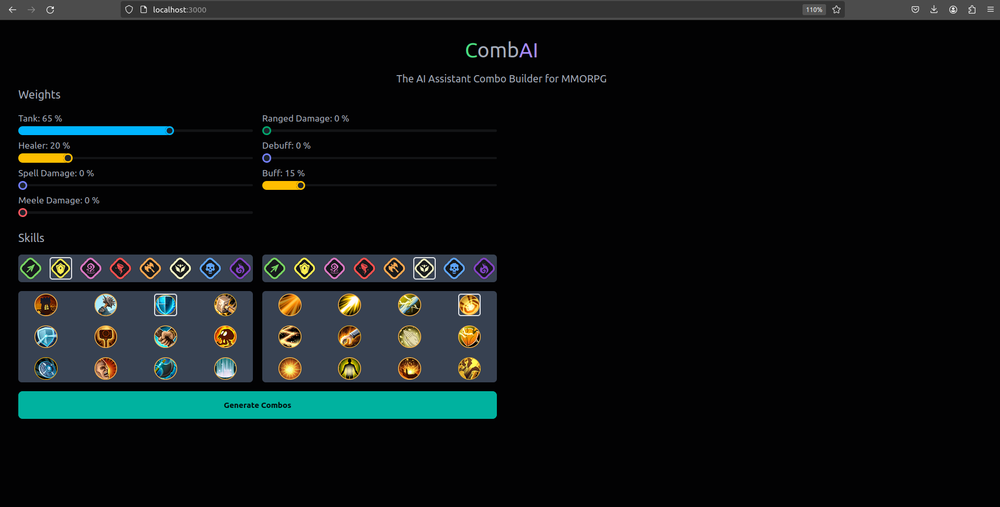
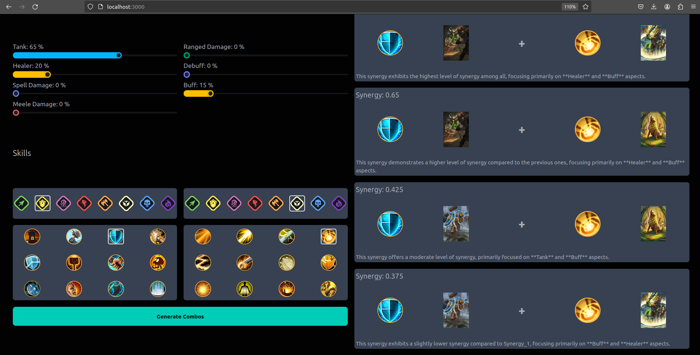
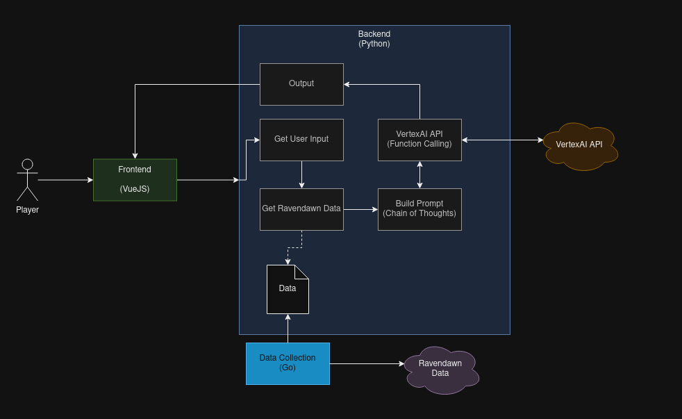

# CombAI
CombAI is a MMORPG AI Assistant focused on helping Ravendawn players to build their own Classes Combos with the respective Ravencard.

> We have the authorization from Tavernlight Games to use the Ravendawn data only for the hackathon purpose. Please, before use this project make sure to respect their [Terms and Conditions](https://ravendawn.online/en/terms-and-conditions).

> This project is a Proof of Concept (PoC) for the Google AI Hackathon. The code is not ready for production.

# Video Presentation

* [Youtube Video](https://youtu.be/_qzbOItWlR8)

# How to start the application:

* Pre-requisites:
  * Docker

1. Create the `backend/secrets` folder and include the Google AI API (Vertex AI) `credentials.json` file inside of that folder. 
    * [Google Documentation for creating the credentials](https://developers.google.com/workspace/guides/create-credentials)

2. Start the application with docker compose command:
```sh
$ sudo docker compose up --build -d
```

3. Access `localhost:3000` for the frontend application

# (Optional) Update the data folder

* Pre-requisites:
  * Go

> It is important to note this script can be broken if the ravendawn website has new information and the translation is not ready. You will need to include new translation in `internal/templates/translation`.

1. You can use the current `data` folder, however if you want to update the `data` folder with latest information run:
```
$ go run ./cmd/main.go
```

# Screenshots

## User Input


## Application Output


# Application Architecture
